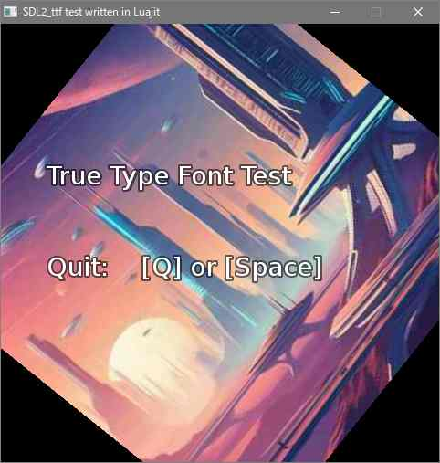

### luajit-sdl2_ttf

---

SDL2_ttf library for LuaJIT

This project is mainly used [luajit-platformer](https://github.com/dinau/luajit-platformer).

#### Test program

---

On Windows OS,  
it needs to be installed **SDL2.dll**, **SDL2_image** and **SDL2_ttf.dll** to current directory at least.  
Also needs **luajit.exe** binary.

```sh
git clone https://github.com/dinau/luajit-sdl2_ttf
cd luajit-sdl2_ttf
cd test
test.bat
```

`test.bat` is the TrueType font load test program.


